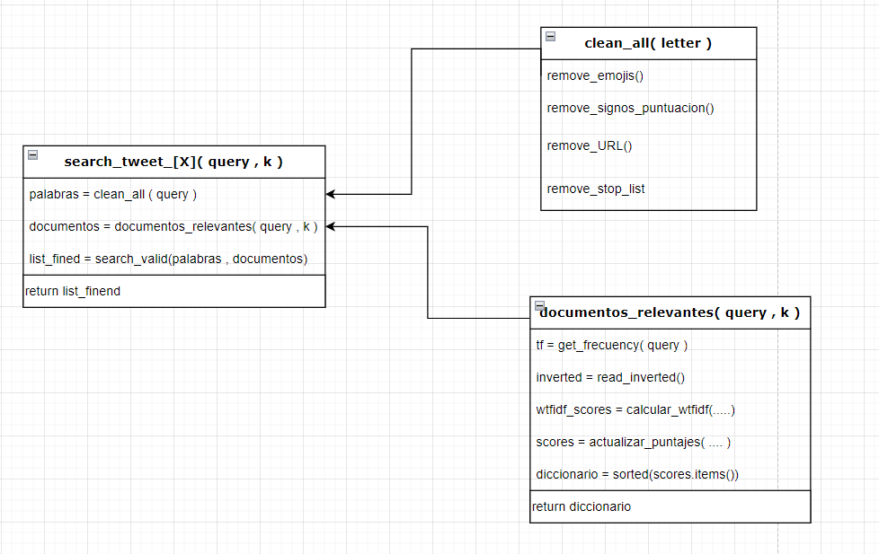
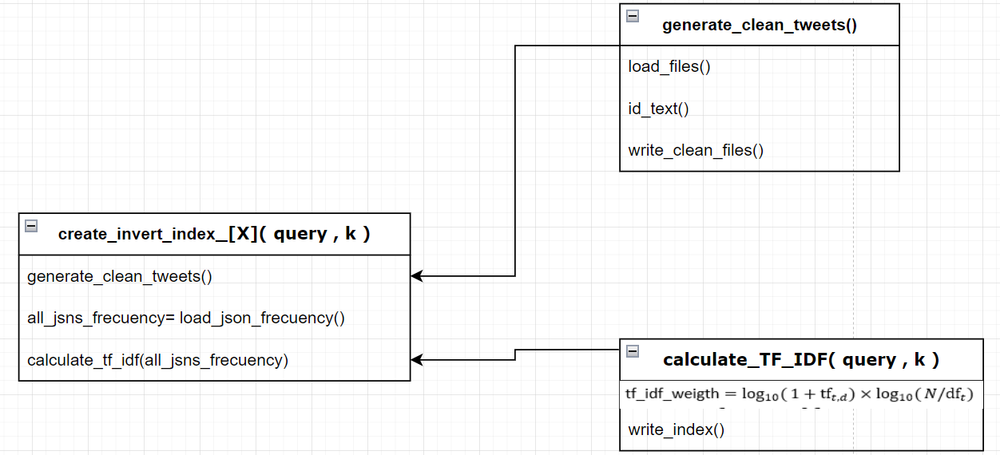

# Índice Invertido para Búsqueda y Recuperación de Información

Este proyecto se centra en la implementación de un Índice Invertido eficiente para la búsqueda y recuperación de información en documentos de texto. En este README se presentarán los detalles del proyecto, incluyendo los objetivos, la descripción del sistema, los requisitos y las instrucciones de instalación.

## Integrante  
- Marco Wanly Obregón Casique [202010147]

## Docente  
- Heider Sanchez Enriquez

## Objetivos

El objetivo principal de este proyecto es desarrollar un sistema de búsqueda y recuperación de información basado en el Índice Invertido. Los objetivos específicos incluyen:

- Implementar el algoritmo de construcción del Índice Invertido.
- Realizar el preprocesamiento de los documentos de texto, incluyendo tokenización y filtrado de stopwords.
- Aplicar el cálculo de pesos TF-IDF para la ponderación de términos.
- Diseñar e implementar una interfaz de usuario para realizar consultas y mostrar los resultados.


## Descripción del Sistema

El sistema se compone de dos partes principales: el backend y el frontend.

### Backend

En el backend, se implementa el Índice Invertido y se realiza el procesamiento de los documentos. Las tareas realizadas incluyen:

- Tokenización: Dividir los documentos en palabras o términos.
- Filtrado de stopwords: Eliminar palabras comunes que no aportan información relevante.
- Cálculo de pesos TF-IDF: Asignar pesos a los términos según su frecuencia en los documentos y en la colección.
- Construcción del Índice Invertido: Estructurar y organizar la información de los términos y documentos.

### Frontend

El frontend consiste en una interfaz de usuario que permite realizar consultas y mostrar los resultados de búsqueda. Las funcionalidades incluyen:

- Entrada de consulta: El usuario puede ingresar una consulta en lenguaje natural.
- Procesamiento de consulta: Se realiza el preprocesamiento de la consulta para buscar los términos relevantes.
- Búsqueda en el Índice Invertido: Se busca en el Índice Invertido los documentos que coincidan con la consulta.
- Presentación de resultados: Los resultados de la búsqueda se muestran al usuario de forma clara y legible.

## Requisitos

Para ejecutar el proyecto, se requiere tener instalado lo siguiente:  

- Backend:  
```
fastapi==0.68.1
uvicorn==0.15.0
nltk==3.6.3
psycopg2==2.9.1
```

- Frontend:  

```
Angular = 15.2.2
Node = v14.20.1
```
## Instrucciones de Instalación

- Backend:  
```
git clone https://github.com/OBCApps/search-text.git
cd search-text
pip install -r requirements.txt
python3 -m uvicorn api:app --host 0.0.0.0 --port 8000
```
- Frontend:  
```
git clone https://github.com/OBCApps/search-text.git
cd search-text
npm install
ng serve --open
```
## Función de las técnicas  


### Vista Web 


### Busqueda de elementos

- Tokenizar y evaluar la relevancia de la consulta.
- Comparar con los índices invertidos y ordenar los resultados.
- Presentar los resultados más relevantes al usuario  

```py
def search_tweet(query, k): 
    print("search_tweet_local(query, k):")
    global direction_dataset_clean
    direction_dataset_clean = "./src/clean_data" 

    global direction_indexs
    direction_indexs =  "./src/indexs-local/index"
    documentos = documentos_relevantes(clean_all(query)) 
    palabras = clean_all(query) 

    list_fined = search_valid(documentos , palabras)

    
    return list_fined[:k]
```  
#### Diagrama  


### Creación del Indice Invertido  
- Extraer el ID y el texto relevante de cada archivo JSON.
- Leer y procesar los archivos como diccionarios.
- Limpiar y tokenizar el texto de cada tweet.
- Calcular la frecuencia de cada palabra en los tweets (tf - term frequency).
- Calcular el puntaje TF-IDF para cada palabra.
- Agrupar los resultados por cada 5 documentos.
- Escribir un índice invertido en la memoria secundaria para cada grupo de documentos  

```py  
def create_invert_index():
    generate_clean_tweets()
    print("... Construcción Indice Local.. ")
    global ruta_archivo
    ruta_archivo = "./src/indexs-local"
    
    global direction_dataset_clean
    direction_dataset_clean = "./src/clean_data"

    global nanmes_docs
    nanmes_docs = os.listdir(direction_dataset_clean) 
    
    all_jsns_frecuency = [] 

    for filename in nanmes_docs:
        lista = []       
        with open(direction_dataset_clean + '/' + filename, 'r', encoding='utf-8') as all_tweets:
            print(f"Load File: {direction_dataset_clean + '/' + filename}")
            all_tweets_dictionary = json.load(all_tweets)
            for tweet in all_tweets_dictionary: 
                temp = clean_all2(all_tweets_dictionary[tweet]) 
                lista.append(Counter(temp))
            all_jsns_frecuency.append( sum(lista, Counter()) ) 
    
    calculate_TF_IDF(all_jsns_frecuency)
    print("... Construcción Local Finalizada .. ")

```  

#### Diagrama  
  

### Manejo de Memoria Secundaria  
- Para este sistema se aplicó la división entre documentos. Cada 5 documentos procesados obtener un archivo indice. Esto con el fin de dividir el trabajo en partes más pequeñas y manejables. Esto es útil cuando se trabaja con documentos extensos y dividirlo en varios bloques evitamos problemas de sobrecarga en memoria y se mejora la eficiencia.  

### Tabla de Comparación de tiempos  


